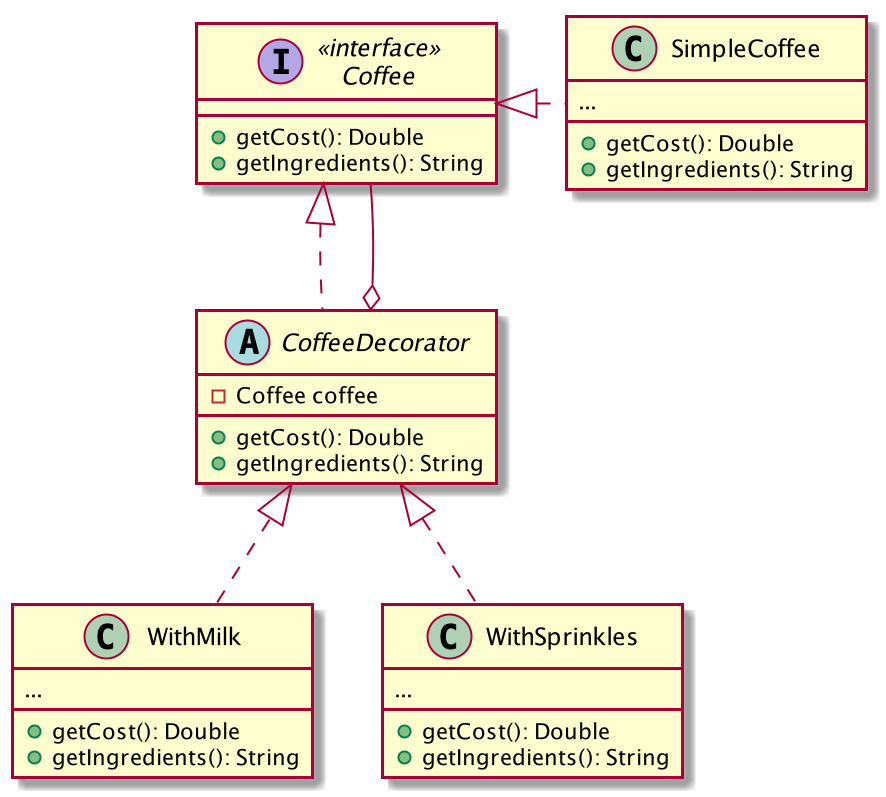

= Le patron de conception Décorateur en Dart
:nofooter:
:stylesdir: ../../css/
:stylesheet: core.min.css
:source-highlighter: highlightjs
:highlightjsdir: ../../highlight

== 29 Octobre 2019

[quote,Mon professeur d'IUT]
Un patron de conception est la meilleure solution à un problème de conception connu.

== Qu'est-ce que c'est ?

*Décorateur* est un patron de conception, un des 23 des patrons de conceptions du *Gang des 4* (link:https://en.wikipedia.org/wiki/Design_Patterns[Gang of Four's]).
Avec eux, vous pouvez résoudre des problèmes de conception, concevoir des logiciels orientés objets flexibles et réutilisables, avec des composants que les développeurs peuvent facilement implémenter, modifier, tester et réutiliser.

*Décorateur* est un modèle de conception structurelle qui vous permet d'ajouter de nouveaux comportements (au moment de l'exécution) aux objets en les enveloppant dans un objet d'une classe de décoration, qui contient les comportements.
*Décorateur* offre une alternative flexible à l'utilisation de l'héritage pour modifier le comportement.

== Quel problème résout-il ?

Si vous avez besoin de modifier le comportement d'un objet, vous allez d'abord penser à étendre la classe.
Cependant, lorsqu'une classe étend d'une autre, elles sont toutes deux liées au moment de la compilation et ne peuvent pas être séparées dynamiquement.
En effet, l'héritage est statique.
Vous pouvez simplement remplacer l'objet par un autre créé à partir d'une sous-classe différente.
De plus, l'héritage ne permet pas à la classe d'hériter de plusieurs classes en même temps : une classe enfant ne peut avoir qu'une seule classe parente.

L'un des moyens de surmonter ces soucis consiste à utiliser l'*agrégation* ou la *composition* au lieu de l'*héritage*.
Les deux alternatives fonctionnent presque de la même manière : un objet a une référence à un autre et lui délègue du travail, alors qu'avec l'héritage, l'objet lui-même est capable de faire ce travail, héritant du comportement de sa superclasse.
Avec cette nouvelle approche, vous pouvez facilement remplacer l'objet « assistant » lié par un autre, en modifiant le comportement du conteneur lors de l'exécution.
Un objet peut utiliser le comportement de différentes classes, ayant des références à plusieurs objets et leur déléguant toute sorte de travail.
*L'agrégation*/*la composition* est le principe clé derrière de nombreux modèles de conception, y compris *Décorateur*.

== Quelle solution décrit-il ?

Définissez les objets décorateurs qui implémentent l'interface de l'objet étendu (décoré) de manière transparente en lui transmettant toutes les requêtes et en exécutant des fonctionnalités supplémentaires avant/après la transmission d'une requête.
Cela permet de travailler avec différents objets décorateurs pour étendre la fonctionnalité d'un objet de manière dynamique au moment de l'exécution.

== Exemple d'implémentation

Nous avons une classe abstraite `Coffee` avec un prix et des ingrédients :

[source,dart]
----
abstract class Coffee {
  double get cost;

  String get ingredients;
}
----

`SimpleCoffee`  est la représentation concrète de la classe `Coffee` :

[source,dart]
----
class SimpleCoffee implements Coffee {
  @override
  double get cost => 1;

  @override
  String get ingredients => "Coffee";
}
----

Nous voulons ajouter un autre type de `Coffee`, comme un café au lait ou avec des pépites.
Mais, si nous voulons prendre un café avec du lait et des pépites, cela va être compliqué avec l'héritage.
Alors, allons-y avec la composition et le patron de conception *Décorateur*:

[source,dart]
----
abstract class CoffeeDecorator implements Coffee {
  final Coffee decoratedCoffee;

  CoffeeDecorator(this.decoratedCoffee);

  @override
  double get cost => decoratedCoffee.cost;

  @override
  String get ingredients => decoratedCoffee.ingredients;
}
----

`CoffeeDecorator` est un délégué qui va modifier le comportement de `Coffee`.

[source,dart]
----
class WithMilk extends CoffeeDecorator {
  WithMilk(Coffee decoratedCoffee) : super(decoratedCoffee);

  @override
  double get cost => super.cost + 0.5;

  @override
  String get ingredients => super.ingredients + ", Milk";
}
----

[source,dart]
----
class WithSprinkles extends CoffeeDecorator {
  WithSprinkles(Coffee decoratedCoffee) : super(decoratedCoffee);

  @override
  double get cost => super.cost + 0.2;

  @override
  String get ingredients => super.ingredients + ", Sprinkles";
}
----

`WithMilk` et `WithSprinkles` sont toutes les deux des implémentations concrètes du décorateur qui mixent du lait ou des pépites avec du café.

Voilà un petit programme qui créé un `Coffee` et le décore avec du lait et des pépites, puis affiche son prix et ses ingrédients

[source,dart]
----
main() {
  Coffee coffee = SimpleCoffee();
  printInformations(coffee); // Cost: 1.0; Ingredients: Coffee

  coffee = WithMilk(coffee);
  printInformations(coffee); // Cost: 1.5; Ingredients: Coffee, Milk

  coffee = WithSprinkles(coffee);
  printInformations(coffee); // Cost: 1.7; Ingredients: Coffee, Milk, Sprinkles
}

void printInformations(Coffee coffee) {
  print("Cost: ${coffee.cost}; Ingredients: ${coffee.ingredients}");
}
----