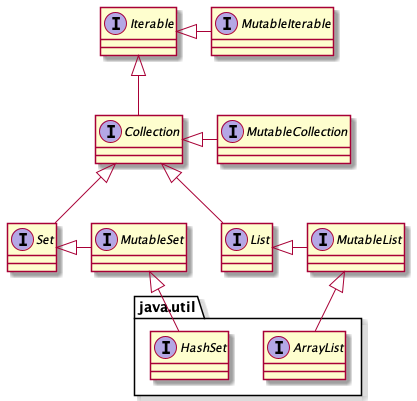

= Limiter la mutabilité en Kotlin
:nofooter:
:stylesdir: ../../css/
:stylesheet: core.min.css
:source-highlighter: highlightjs
:highlightjsdir: ../../highlight

== 14 Mars 2021

Il est plus difficile de comprendre et déboguer un programme contenant plusieurs points de mutation.
Une classe avec de nombreux points de mutations, dépendant des uns et des autres, va être compliqué à comprendre et à modifier, et peut engendrer des situations inattendues ou des erreurs.

De plus, l'immutabilité facilite le raisonnement.
Un état immutable est clair : il n'est pas modifiable et ne peut donc pas changer.
À l'inverse, un état mutable est difficile à appréhender car celui-ci peut changer à tout moment.
De plus, même vérifié, rien ne nous garantit que cet état n'a pas déjà changé.

Quand un état mute, les objets dépendant de celui-ci doivent être notifiés du changement.
Par exemple, si une liste ordonnée contient un élément mutable, quand cet objet change, alors il faut ordonner de nouveau la liste.

Kotlin est pensé pour limiter la mutabilité : il est facile de créer des objets immutables et de garder les propriétés immutables.

=== Les propriétés en lecture seule `val`

Le mot clef `val` empêche la ré-initialisation d'une propriété :

[source,kotlin]
----
val a = 10
a = 20 // Erreur
----

Cependant, une propriété en lecture seule n'empêche pas obligatoirement la mutation.
Par exemple, une propriété en lecture seule peut contenir un objet mutable :

[source,kotlin]
----
val liste = mutableListOf(1, 2, 3, 4)
liste.add(5) // [1, 2, 3, 4, 5]
----

=== Les collections en lecture seule

En Kotlin, les collections en lecture seule sont séparées des collections mutables.

Les collections en lecture seule ne sont pas nécessairement immutables.
Très souvent, celles-ci sont mutables, mais elles sont cachées derrière une interface en lecture seule.
Par exemple, la méthode `Iterable.map` retourne une `ArrayList` (mutable), en tant que `List` (immutable).

Pour passer d'une collection immutable à une collection mutable, il faut utiliser les méthodes de la bibliothèque standard : `toMutableSet()` ou `toMutableList()`.

On peut modifier une collection d'éléments de deux manières :

[source,kotlin]
----
val liste1 = mutableListOf<Int>()
var liste2 = listOf<Int>()

liste1 += 1 // liste1.plusAssign(1)
liste2 += 1 // liste2 = liste2.plus(1)

// À éviter
var liste3 = mutableListOf<Int>()
----

=== La copie des classes de données

Le mot clé `data` permet au compilateur de générer, à partir de chaque propriété dans le constructeur primaire, les méthodes suivantes : `equals()`, `hashCode()`, `toString()`, `componentN()` et `copy()`.

[source,kotlin]
----
data class Utilisateur(
    val prenom: String,
    val nom: String
)

var utilisateur = Utilisateur("Corentin", "Leffy")
utilisateur = utilisateur.copy(prenom = "Henri") // Utilisateur(prenom=Henri, nom=Leffy)
----

Il s'agit d'une solution simple qui permet de rendre les classes de données immuables.
Cette solution est moins "efficace" que d'utiliser directement un objet mutable à la place, mais elle présente tous les avantages des objets immuables et est à préférer par défaut.

=== L'exposition des propriétés mutables

Si une propriété mutable définit l'état d'un objet, alors il ne faut pas que celle-ci soit exposée publiquement.

Prenons en considération le code suivant :

[source,kotlin]
----
class TousLesUtilisateur {
    private val utilisateursStockes = mutableListOf<Utilisateur>()

    operator fun invoke(): MutableList<Utilisateur> = utilisateursStockes
}
----

On peut modifier l'état de `TousLesUtilisateur`, à partir de la méthode `invoke()` :

[source,kotlin]
----
val tousLesUtilisateurs = TousLesUtilisateurs()
val utilisateursStockes = tousLesUtilisateurs()
utilisateursStockes.add(Utilisateur("John", "Doe")) // Oups
----

Pour empêcher des modifications accidentelles, deux solutions s'offrent à nous :

- Retourner une copie de l'objet (grâce à la méthode `copy()` par exemple)
- Modifier le type de retour, pour que ce type ne permette que de la lecture :

[source,kotlin]
----
class TousLesUtilisateur {
    private val utilisateursStockes = mutableListOf<Utilisateur>()

    operator fun invoke(): List<Utilisateur> = utilisateursStockes
}
----

=== Conclusion

Il faut limiter les points de mutation :

- Préferer `val` à `var`.
- Préférer une propriété immutable à une propriété mutable.
- Si une propriété doit changer, considérer l'utilisation d'une `data class` et de la méthode `copy()`.
- Préférer des collections en lecture seule plutôt que des collections mutables.
- Ne pas exposer publiquement les objets mutables.

Source : https://leanpub.com/effectivekotlin/[Effective Kotlin]